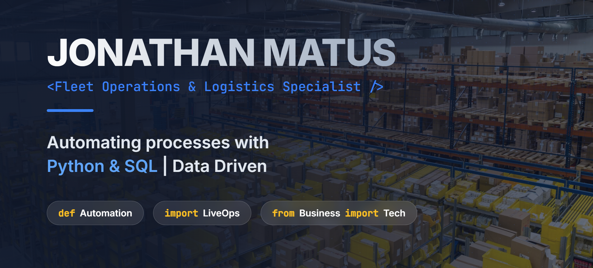

# Portafolio Profesional

Este es el repositorio del código fuente de mi portafolio profesional, una single-page application (SPA) estática que narra mi trayectoria desde Ingeniero en Logística a Desarrollador de Soluciones.

El proyecto está diseñado para ser un escaparate interactivo de mi experiencia, proyectos clave y competencias técnicas, demostrando cómo aplico mi conocimiento dual (Operaciones + Tecnología) para resolver problemas de negocio complejos.

**[Ver el portafolio en vivo](https://jotaem.github.io/Portafolio-Jona-3.0/index.html#inicio)**

## Tecnologías Utilizadas

Este portafolio está construido desde cero utilizando tecnologías web estándar para asegurar un rendimiento óptimo y una alta compatibilidad.

-   **Frontend:**
    -   HTML5
    -   CSS3
    -   JavaScript (ES6+)
-   **Frameworks y Librerías:**
    -   **Bootstrap 5.3:** Para el layout responsive y los componentes de UI.
    -   **Chart.js:** Para la visualización de los KPIs del proyecto "LiveOps Engine".
    -   **pdf.js:** Para renderizar previsualizaciones de los certificados directamente en el navegador.
    -   **Bootstrap Icons:** Para el conjunto de iconos.
    -   **Google Fonts:** Para la tipografía (`Inter`).
-   **Herramientas de Desarrollo:**
    -   **Python 3:** Para scripting de apoyo (generación de thumbnails).
    -   **Pillow & pdf2image:** Librerías de Python utilizadas para procesar PDFs.

## Estructura del Proyecto

```
.
├── assets/
│   ├── certificates/         # (Placeholder)
│   ├── degree_certificates/  # PDFs de títulos académicos
│   ├── images/               # Logos de empresas, etc.
│   ├── linkedin_certificates/# PDFs de certificados de LinkedIn
│   └── performance_reviews/  # PDFs de evaluaciones de desempeño
├── css/
│   └── style.css             # Hoja de estilos principal
├── js/
│   └── main.js               # Lógica principal de la aplicación
├── CHANGELOG.md              # Historial de cambios del proyecto
├── config.json               # Configuración (si aplica)
├── generate_thumbnails.py    # Script para crear miniaturas de PDFs
├── index.html                # El archivo principal de la aplicación
└── README.md                 # Este archivo
```

## Características Clave del Portafolio

-   **Narrativa Profesional:** La estructura sigue el "viaje del héroe", mostrando la evolución de una carrera en operaciones a una en tecnología.
-   **Proyecto Destacado Interactivo:** La sección "LiveOps Engine" incluye gráficos interactivos que permiten al usuario explorar los resultados y KPIs del proyecto.
-   **Visualización de Documentos:** Los certificados académicos y de LinkedIn se cargan dinámicamente y se pueden previsualizar sin salir de la página, utilizando `pdf.js`.
-   **Diseño Responsivo (Mobile-First):** Totalmente adaptable a dispositivos de escritorio, tabletas y móviles gracias a Bootstrap 5.
-   **Tema Claro/Oscuro:** Un interruptor permite al usuario cambiar entre un tema claro y uno oscuro para una mejor experiencia de visualización.
-   **Línea de Tiempo Interactiva:** La trayectoria profesional se presenta en una línea de tiempo vertical y visual.

---

&copy; 2025 Jonathan Matus Vidal